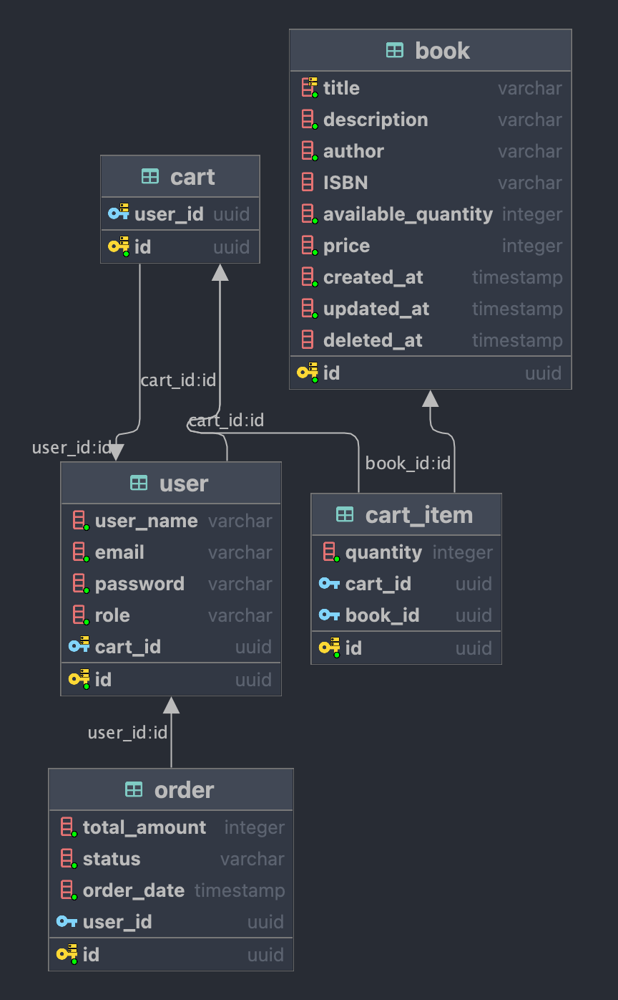

# NESTJS library book

### Tect Stack :
- NestJS
- TypeScript
- TypeORM
- PostgreSQL
- Redis
- EJS
- TailwindCSS

### How to run :
- Clone this repository
- create and fill .env file :
```
DB_HOST=
DB_PORT=
DB_USERNAME=
DB_PASSWORD=
DB_DATABASE=
DB_SYNCHRONIZE=

REDIS_HOST=
REDIS_PORT=

JWT_SIGN_SECRET=
```
- Run `npm install` or `pnpm install`
- Run `npm run start:dev` or `pnpm run start:dev`

### Detail ERD diagram library book :
